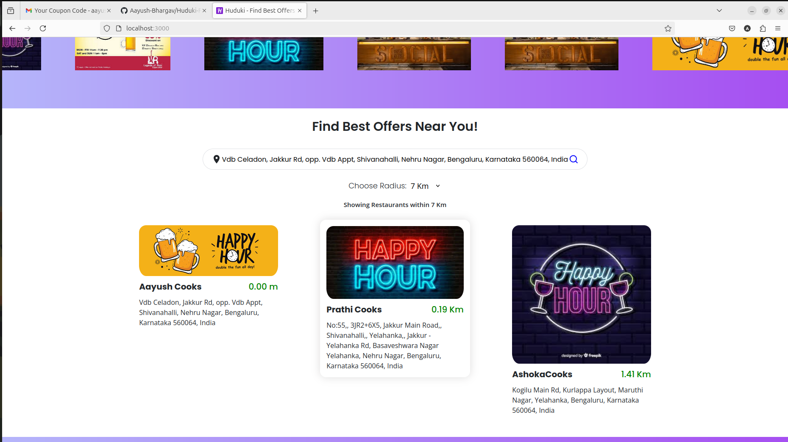
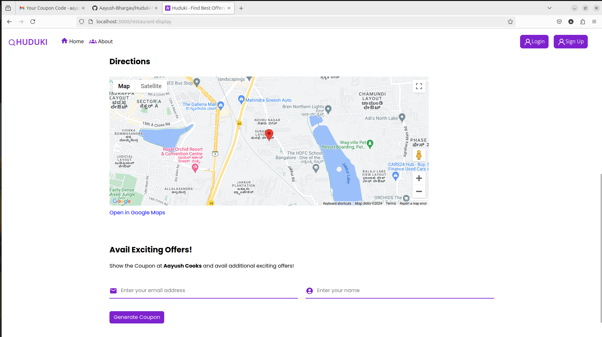
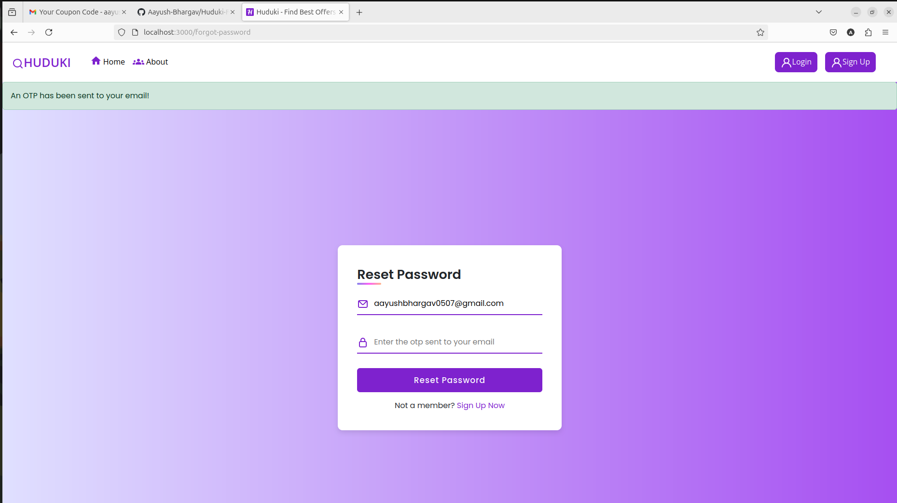

# Huduki-Find-Best-Offers
Huduki is a comprehensive MERN web application that connects users with special offers from various dining and drinking establishments. It provides a seamless experience for both users and restaurant owners, featuring real-time offer displays, dynamic search capabilities, and coupon generation. Built with the MERN stack (MongoDB, Express.js, React, Node.js), Huduki ensures a secure and interactive experience. This is a website that I solely built as part of an unpaid internship this summer.

## Screenshots

### Home Page 

### Home Page 1

### Search Nearby Restaurants

### Restaurant Info

### Login Page

### Signup Page

### Forgot Password Page

### Edit Details Page

### Verify Coupon Page

### About Page

## Features

- **Trending Offers**: View a carousel of trending offers from various bars, pubs, and restaurants.
- **Location-Based Search**: Enter a location and specify a radius to find restaurants with offers in the vicinity.
- **Restaurant Details**: Click on a restaurant to view detailed information, including an embedded Google Maps view.
- **Coupon Generation**: Generate coupons for additional discounts. Track usage to monitor the business generated through the app.
- **Secure Authentication**: User and restaurant authentication with secure login and registration processes.
- **Payment Integration**: Seamless payment for restaurant registration through Razorpay.
- **Email Notifications**: Automated email notifications using Nodemailer for password recovery and registration details.

## Technologies Used

- **MERN Stack**: Utilizes MongoDB, Express.js, React, and Node.js to provide a full-stack solution.
- **Node.js & Express**: Backend services including authentication and restaurant management.
- **MongoDB**: Stores user data, restaurant information, payments, and coupons.
- **React**: Frontend framework for a responsive and dynamic user interface.
- **Google Maps API**: Embedded maps for displaying restaurant locations.
- **Nodemailer**: Handles email notifications for user and restaurant communication.
- **Razorpay**: Integrated payment gateway for handling restaurant registration fees.
- **Multer**: Used for handling file uploads to the backend.

