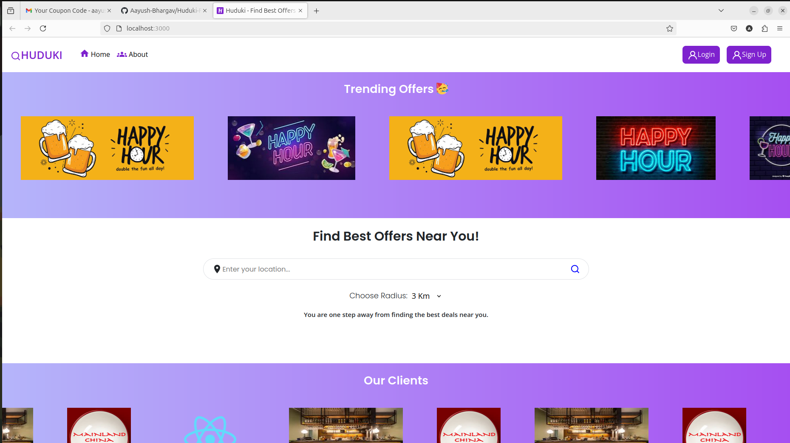
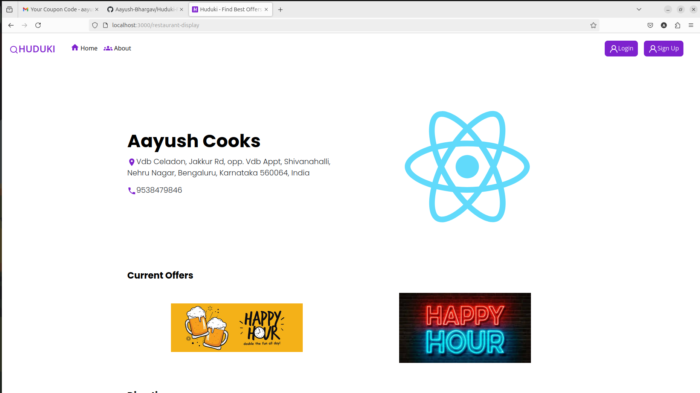
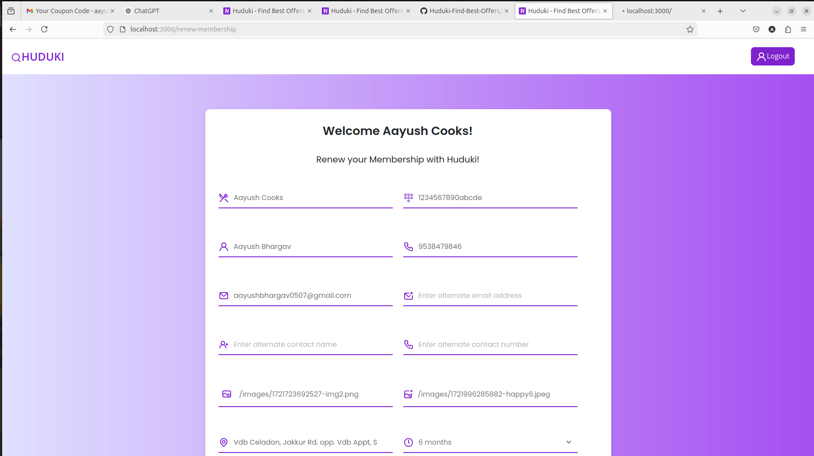
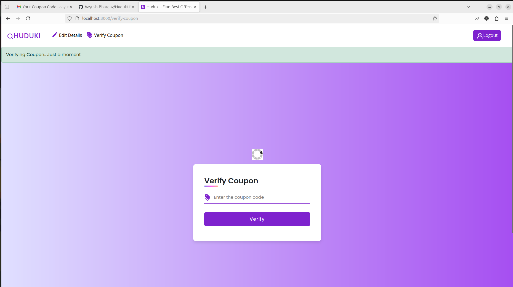
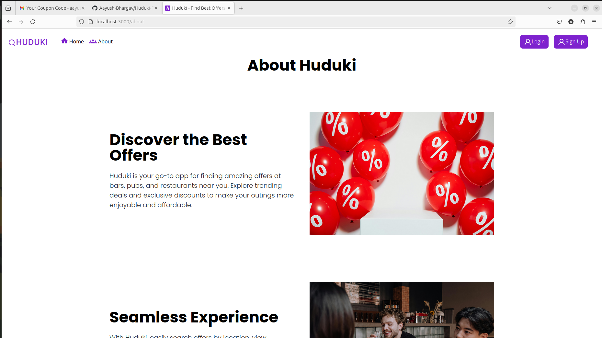

# Huduki- Find the Best Offers On Restaurants, Bars and Pubs online!
Huduki is a comprehensive MERN web application that connects users with special offers from various dining and drinking establishments. It provides a seamless experience for both users and restaurant owners, featuring real-time offer displays, dynamic search capabilities, and coupon generation. Built with the MERN stack (MongoDB, Express.js, React, Node.js), Huduki ensures a secure and interactive experience. This is a website that I solely built as part of an internship this summer.

## Install
Clone the repo 
```
git clone https://github.com/Aayush-Bhargav/Huduki-Find-Best-Offers.git
```
Go to the required directory
```
cd Huduki-Find-Best-Offers
```
Install frontend dependencies
```
npm install
```
Open a new terminal and Install backend dependencies
```
cd backend
npm install
```
Create a **.env** file in the root directory of the project and add your google maps API key and Razorpay key id. You can use the provided **SampleENV.txt** file as a template:
```
cp SampleENV.txt .env
```
Create a **.env** file in the **backend** directory of the project and the required sensitive information. You can use the provided **sampleENV.txt** file as a template:
```
cp sampleENV.txt .env
```

## Launch

Launch the server 
```
nodemon index.js
```
Launch the frontend
```
npm start
```
**Make sure mongo DB server is running on your localhost and listening on the default port 27017.**

## Screenshots

### Home Page 



### Search Nearby Restaurants


### Restaurant Info



### Login Page


### Signup Page


### Forgot Password Page


### Edit Details Page


### Renew Membership Page



### Verify Coupon Page


### About Page



### Payment Portal


### Mobile View


### Mails Screenshots


## Features

- **Trending Offers**: View a carousel of trending offers from various bars, pubs, and restaurants.
- **Location-Based Search**: Enter a location and specify a radius to find restaurants with offers in the vicinity.
- **Restaurant Details**: Click on a restaurant to view detailed information, including an embedded Google Maps view.
- **Coupon Generation**: Generate coupons for additional discounts. Track usage to monitor the business generated through the app. Securely verify the validity of the coupons after logging in.
- **Secure Authentication**: User and restaurant authentication with secure login registration and membership renewal processes.
- **Payment Integration**: Seamless payment for restaurant registration through Razorpay.
- **Email Notifications**: Automated email notifications using Nodemailer for password recovery and registration details.

## Technologies Used

- **MERN Stack**: Utilizes MongoDB, Express.js, React, and Node.js to provide a full-stack solution.
- **Node.js & Express**: Backend services including authentication, restaurant management and finding restaurants within a certain radius.
- **MongoDB**: Stores user data, restaurant information, payments, and coupons.
- **React**: Frontend framework for a responsive and dynamic user interface.
- **Google Maps API**: Embedded maps for displaying restaurant locations.
- **Nodemailer**: Handles email notifications for user and restaurant communication.
- **Razorpay**: Integrated payment gateway for handling restaurant registration fees.
- **Multer**: Used for handling file uploads to the backend.
- **PDF Generation**: Backend functionality for generating PDFs for registration and membership renewal invoices.

